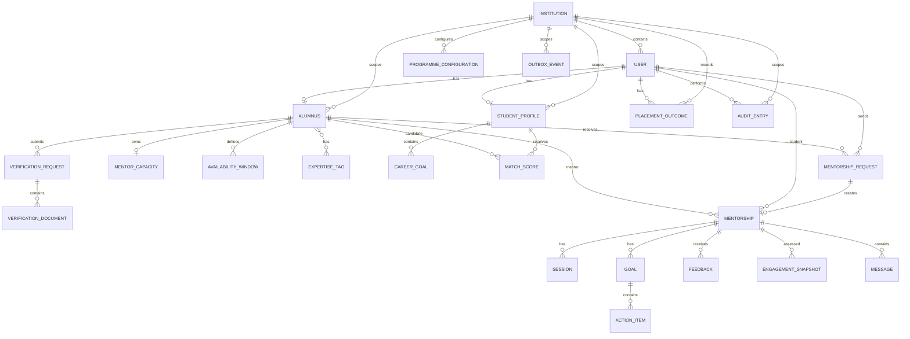

# Database Design & Entity–Relationship Model

## Project 11 — Alumni Mentorship and Career Network

**Product:** Verified Alumni Mentorship Matching and Engagement Platform  
**Project ID:** P11  
**Document:** Database Design & Entity–Relationship Model  
**Version:** 1.0  
**Status:** Foundation Draft  
**Database:** MongoDB 7+  
**ODM:** Mongoose  
**Architecture:** Track J — Path J1 (Next.js Full-Stack)  
**Baselines:** P11 PRD v1.0, SRS v1.0, HLD v1.0
**Project Source:** `docs/P11_Project_Source.md` — P11 source extract
**Engineering Standard:** Common Engineering Standard (CES)

---

## Table of Contents

| No. | Section | Purpose |
| ---: | --- | --- |
| 1 | Database Design Purpose | Defines the role of this document. |
| 2 | Database Design Principles | Defines modelling rules. |
| 3 | Database Architecture | Defines MongoDB storage and ownership. |
| 4 | Entity Inventory | Lists P11 entities. |
| 5 | Core Identity and Institution | Defines identity and tenant data. |
| 6 | M1 — Alumni Verification and Profile | Alumni, verification and expertise data. |
| 7 | M2 — Capacity and Availability | Capacity and availability data. |
| 8 | M3 — Student Career Profile | Student profile and career goals. |
| 9 | M4 — Matching | Matching result data. |
| 10 | M5 — Requests and Mentorship | Requests and relationships. |
| 11 | M6 — Scheduling and Sessions | Session and calendar references. |
| 12 | M7 — Goals, Actions and Feedback | Goals, actions and feedback. |
| 13 | M8 — Engagement | Engagement snapshots. |
| 14 | M9 — Messaging | Relationship-scoped messages. |
| 15 | M10 — Analytics and Audit | Analytics, outbox, and audit data. |
| 16 | Entity Relationships and ERD | Logical relationship model. |
| 17 | Indexes and Query Strategy | Required indexes and query patterns. |
| 18 | Integrity and Concurrency Rules | Database correctness constraints. |
| 19 | Privacy and Sensitive Data | Restricted-data storage rules. |
| 20 | Data Lifecycle and Retention | Lifecycle and retention. |
| 21 | Transactions and Atomic Operations | Atomicity and transaction boundaries. |
| 22 | Seed Data and Demo Readiness | Seed requirements. |
| 23 | Database Traceability | Source traceability. |
| 24 | Open Database Decisions | Unresolved database decisions. |

---

# 1. Database Design Purpose

This document defines the **logical database design** for P11.

It translates the P11 SRS requirements and HLD architecture into:

- collections and entities;
- relationships;
- ownership;
- core fields;
- validation constraints;
- references and embedding decisions;
- indexes;
- integrity rules;
- institution/tenant context;
- privacy boundaries;
- lifecycle considerations;
- concurrency-related persistence requirements.

This document does not define API routes, UI behaviour, application folder structure, or deployment topology.

---

# 2. Database Design Principles

## 2.1 Authoritative Store

MongoDB is the authoritative durable store for core P11 business data.

Redis is not authoritative for core business records such as alumni, profiles, requests, mentorships, sessions, goals, feedback, engagement, messages, or audit records.

## 2.2 Module Ownership

Each P11 module owns its persistence models.

```text
M1 → Alumni / Verification / Expertise
M2 → Capacity / Availability
M3 → Student Profile / Career Goals
M4 → Match Scores
M5 → Mentorship Requests / Mentorships
M6 → Sessions
M7 → Goals / Action Items / Feedback
M8 → Engagement Snapshots
M9 → Messages
M10 → Analytics support / Audit
Cross-cutting → Outbox events
```

A module shall not directly access another module's persistence model. Cross-module interaction uses the internal service interfaces defined by the HLD.

## 2.3 Institution Context

Every domain record shall carry institution context.

Minimum common field:

```text
institutionId
```

This preserves the CES requirement that the system be multi-tenant-ready from day one.

## 2.4 Identifier Convention

MongoDB documents use:

```text
_id : ObjectId
```

References point to the owning document's `_id`.

## 2.5 Common Timestamps

Business collections should include `createdAt` and `updatedAt` where applicable.

Append-only/event-oriented records such as engagement snapshots, audit entries, messages, and feedback preserve their event/submission time.

## 2.6 Reference vs Embedding

Use references for entities with independent lifecycles, independent queries, or unbounded growth.

Embedding is reserved for small bounded value structures or tightly coupled snapshots.

Messages are therefore separate documents rather than an array embedded in a mentorship document.

---

# 3. Database Architecture

## 3.1 Logical Collection Structure

```text
MongoDB
├── institutions
├── users
├── alumni
├── verification_requests
├── expertise_tags
├── mentor_capacities
├── availability_windows
├── student_profiles
├── career_goals
├── match_scores
├── mentorship_requests
├── mentorships
├── sessions
├── goals
├── action_items
├── feedback
├── engagement_snapshots
├── messages
├── verification_documents
├── programme_configurations
├── placement_outcomes
├── audit_entries
└── outbox_events
```

The P11 source identifies the core data model as Alumnus,
VerificationRequest, ExpertiseTag, MentorCapacity, AvailabilityWindow,
StudentProfile, CareerGoal, MatchScore, MentorshipRequest, Mentorship,
Session, Goal, ActionItem, Feedback, Message, and EngagementSnapshot
(P11 §8). User, Institution, AuditEntry, and OutboxEvent are supporting
persistence entities required by the selected architecture and security
requirements.

---

# 4. Entity Inventory

| Entity / Collection | Module | Lifecycle | Purpose |
|---|---|---|---|
| Institution | Core | Long-lived | Institution/tenant scope |
| User | Core | Long-lived | Authenticated identity and role |
| Alumnus | M1 | Long-lived | Alumni/mentor profile |
| VerificationRequest | M1 | Workflow | Verification lifecycle |
| VerificationDocument | M1 | Quarantined/approved | Verification evidence metadata and validation state |
| ExpertiseTag | M1 | Reference | Expertise taxonomy |
| MentorCapacity | M2 | Current state | Mentor capacity |
| AvailabilityWindow | M2 | Current/history | Availability periods |
| StudentProfile | M3 | Long-lived | Student career profile |
| CareerGoal | M3 | Long-lived | Student career goal |
| MatchScore | M4 | Derived | Match/ranking result |
| MentorshipRequest | M5 | Workflow | Student-to-mentor request |
| Mentorship | M5 | Relationship | Mentoring relationship |
| Session | M6 | Event | Mentoring session |
| Goal | M7 | Relationship item | Mentoring goal |
| ActionItem | M7 | Relationship item | Goal action |
| Feedback | M7 | Historical | Student/mentor feedback |
| EngagementSnapshot | M8 | Time-series | Engagement assessment |
| Message | M9 | Conversation | Relationship message |
| ProgrammeConfiguration | Cross-cutting | Versioned configuration | Institution-scoped administrator policies |
| PlacementOutcome | M10 | Imported/long-lived | Authorized placement-outcome correlation data |
| AuditEntry | Cross-cutting | Append-only | Privileged-action audit |
| OutboxEvent | Cross-cutting | Dispatch workflow | Durable asynchronous event |

---

# 5. Core Identity and Institution

## 5.1 Institution

| Field | Type | Required | Notes |
|---|---|---:|---|
| `_id` | ObjectId | Yes | Primary identifier |
| `name` | String | Yes | Institution name |
| `code` | String | Yes | Stable institution code |
| `status` | String | Yes | `active` / `inactive` |
| `createdAt` | Date | Yes | Creation |
| `updatedAt` | Date | Yes | Update |

**Constraint:** `code` shall be unique.

The uniqueness requirement is enforced by a unique index on
`institutions.code`.

## 5.2 User

| Field | Type | Required | Notes |
|---|---|---:|---|
| `_id` | ObjectId | Yes | Primary identifier |
| `institutionId` | ObjectId | Yes | Tenant scope |
| `externalIdentityId` | String | Yes | University SSO identity |
| `role` | String | Yes | Application role |
| `status` | String | Yes | `active` / `inactive` |
| `createdAt` | Date | Yes | Creation |
| `updatedAt` | Date | Yes | Update |

Role values:

```text
student
alumni_mentor
alumni_relations_officer
placement_officer
administrator
```

**Constraint:** `(institutionId, externalIdentityId)` shall be unique.

---

# 6. M1 — Alumni Verification and Profile

## 6.1 Alumnus

| Field | Type | Required | Notes |
|---|---|---:|---|
| `_id` | ObjectId | Yes | Primary identifier |
| `institutionId` | ObjectId | Yes | Tenant scope |
| `userId` | ObjectId | Yes | Owning user |
| `verificationStatus` | String | Yes | `pending`, `verified`, `rejected` |
| `expertiseTagIds` | Array[ObjectId] | No | References institution-scoped ExpertiseTag documents |
| `mentoringInterests` | Array[String] | No | Mentoring areas used for discovery and matching |
| `displayName` | String | Yes | Student-visible |
| `professionalHeadline` | String | No | Profile |
| `currentRole` | String | No | Professional role |
| `industry` | String | No | Industry |
| `email` | String | No | Restricted/private |
| `phone` | String | No | Restricted/private |
| `graduationYear` | Number | No | Alumni information |
| `createdAt` | Date | Yes | Creation |
| `updatedAt` | Date | Yes | Update |

`email` and `phone` are restricted fields and must never be included in student-facing projections.

`verificationStatus` is the current mentor-eligibility projection. The
verification-request collection preserves workflow history; a change to
the current status and its corresponding verification outcome must be
persisted consistently. Mentor eligibility is determined from the current
Alumnus status, not from an arbitrary historical request.

`expertiseTagIds` stores the bounded many-to-many relationship between an
Alumnus and the institution-scoped expertise taxonomy. Referenced tags
must belong to the same institution as the Alumnus.

## 6.2 VerificationRequest

| Field | Type | Required | Notes |
|---|---|---:|---|
| `_id` | ObjectId | Yes | Primary identifier |
| `institutionId` | ObjectId | Yes | Tenant scope |
| `alumnusId` | ObjectId | Yes | Applicant |
| `institutionalIdentifier` | String | Yes | Protected institutional verification identifier; never student-visible |
| `graduationYear` | Number | No | Protected alumni record attribute |
| `status` | String | Yes | `pending`, `verified`, `rejected` |
| `submittedAt` | Date | Yes | Submission |
| `decidedAt` | Date | No | Decision |
| `decidedBy` | ObjectId | No | Reviewing officer |
| `rejectionReason` | String | No | Rejection reason |
| `documents` | Array[ObjectId] | No | References to VerificationDocument records |
| `createdAt` | Date | Yes | Creation |
| `updatedAt` | Date | Yes | Update |

Verification document binaries are not stored in MongoDB; only required metadata/reference information is stored.

The institutional identifier is protected at rest and is available only
to the verification workflow. VerificationRequest history is retained;
new decisions create an auditable state change rather than overwriting
the original submission evidence.

## 6.3 VerificationDocument

| Field | Type | Required | Notes |
|---|---|---:|---|
| `_id` | ObjectId | Yes | Primary identifier |
| `institutionId` | ObjectId | Yes | Tenant scope |
| `verificationRequestId` | ObjectId | Yes | Parent request |
| `objectKey` | String | Yes | Private object-storage reference |
| `fileName` | String | Yes | Submitted file name |
| `declaredContentType` | String | Yes | Caller declaration |
| `detectedContentType` | String | No | Server-detected type after upload |
| `sizeBytes` | Number | Yes | Validated object size |
| `status` | String | Yes | `pending_upload`, `validating`, `approved`, `rejected` |
| `validationMessage` | String | No | Sanitized validation result |
| `uploadedAt` | Date | No | Upload completion |
| `validatedAt` | Date | No | Validation completion |
| `scannedAt` | Date | No | Malware-scan completion |
| `createdAt` | Date | Yes | Creation |
| `updatedAt` | Date | Yes | Update |

Uploaded objects remain quarantined and unavailable to reviewers until
server-side size, magic-byte/MIME, and malware checks succeed. The object
storage adapter owns binary access; MongoDB stores only metadata and the
private object reference.

## 6.4 ExpertiseTag

| Field | Type | Required |
|---|---|---:|
| `_id` | ObjectId | Yes |
| `institutionId` | ObjectId | Yes |
| `name` | String | Yes |
| `status` | String | Yes |
| `createdAt` | Date | Yes |
| `updatedAt` | Date | Yes |

Controlled taxonomy is preferred over duplicated free-form values.

---

# 7. M2 — Capacity and Availability

## 7.1 MentorCapacity

| Field | Type | Required |
|---|---|---:|
| `_id` | ObjectId | Yes |
| `institutionId` | ObjectId | Yes |
| `alumnusId` | ObjectId | Yes |
| `maxConcurrentMentees` | Number | Yes |
| `activeMentees` | Number | Yes |
| `acceptingNewMentees` | Boolean | Yes |
| `updatedAt` | Date | Yes |

Invariant:

```text
0 ≤ activeMentees ≤ maxConcurrentMentees
```

The acceptance path must preserve this invariant under concurrency.

`activeMentees` is a concurrency guard and current-state counter. It
shall be incremented exactly once when an active Mentorship is created and
decremented exactly once when that relationship ends. The counter update
and corresponding Mentorship state change must be committed together
where the MongoDB deployment supports the required transaction boundary.
Reconciliation may detect discrepancies, but it must not replace the
atomic conditional update used by acceptance.

## 7.2 AvailabilityWindow

| Field | Type | Required |
|---|---|---:|
| `_id` | ObjectId | Yes |
| `institutionId` | ObjectId | Yes |
| `alumnusId` | ObjectId | Yes |
| `startAt` | Date | Yes |
| `endAt` | Date | Yes |
| `timezone` | String | Yes |
| `createdAt` | Date | Yes |
| `updatedAt` | Date | Yes |

Validation:

```text
startAt < endAt
```

---

# 8. M3 — Student Career Profile

## 8.1 StudentProfile

| Field | Type | Required |
|---|---|---:|
| `_id` | ObjectId | Yes |
| `institutionId` | ObjectId | Yes |
| `userId` | ObjectId | Yes |
| `interests` | Array[String] | No |
| `targetRoles` | Array[String] | No |
| `targetIndustries` | Array[String] | No |
| `createdAt` | Date | Yes |
| `updatedAt` | Date | Yes |

Career goals are represented by `CareerGoal`.

## 8.2 CareerGoal

| Field | Type | Required |
|---|---|---:|
| `_id` | ObjectId | Yes |
| `institutionId` | ObjectId | Yes |
| `studentProfileId` | ObjectId | Yes |
| `title` | String | Yes |
| `description` | String | No |
| `status` | String | Yes |
| `createdAt` | Date | Yes |
| `updatedAt` | Date | Yes |

Goal status values are `not_started`, `in_progress`, and
`completed`, matching the API contract.

---

# 9. M4 — Matching

## 9.1 MatchScore

| Field | Type | Required | Notes |
|---|---|---:|---|
| `_id` | ObjectId | Yes | Primary identifier |
| `institutionId` | ObjectId | Yes | Tenant scope |
| `studentProfileId` | ObjectId | Yes | Student |
| `alumnusId` | ObjectId | Yes | Candidate mentor |
| `score` | Number | Yes | Ranking score |
| `rank` | Number | Yes | Result rank |
| `reasons` | Array[String] | Yes | Explanation |
| `generatedAt` | Date | Yes | Calculation time |
| `matchingVersion` | String | No | Configuration/version |

Matching is computed on demand. A stored match result is a derived snapshot and must not be the authoritative source for mentor eligibility or capacity.

---

# 10. M5 — Requests and Mentorship

## 10.1 MentorshipRequest

| Field | Type | Required |
|---|---|---:|
| `_id` | ObjectId | Yes |
| `institutionId` | ObjectId | Yes |
| `studentUserId` | ObjectId | Yes |
| `mentorAlumnusId` | ObjectId | Yes |
| `status` | String | Yes |
| `message` | String | No |
| `declineReason` | String | No |
| `createdAt` | Date | Yes |
| `expiresAt` | Date | Yes |
| `respondedAt` | Date | No |
| `respondedBy` | ObjectId | No |

Allowed lifecycle:

```text
pending
 ├── accepted
 ├── declined
 └── expired
```

Only pending requests may be accepted/declined; only unanswered pending requests may expire.

## 10.2 Mentorship

| Field | Type | Required |
|---|---|---:|
| `_id` | ObjectId | Yes |
| `institutionId` | ObjectId | Yes |
| `studentUserId` | ObjectId | Yes |
| `mentorAlumnusId` | ObjectId | Yes |
| `sourceRequestId` | ObjectId | Yes |
| `status` | String | Yes |
| `startedAt` | Date | Yes |
| `endedAt` | Date | No |
| `createdAt` | Date | Yes |
| `updatedAt` | Date | Yes |

Suggested status:

```text
active
ended
```

`sourceRequestId` establishes the request that created the relationship.

Creation must be idempotent.

---

# 11. M6 — Scheduling and Sessions

## 11.1 Session

| Field | Type | Required |
|---|---|---:|
| `_id` | ObjectId | Yes |
| `institutionId` | ObjectId | Yes |
| `mentorshipId` | ObjectId | Yes |
| `startAt` | Date | Yes |
| `endAt` | Date | Yes |
| `timezone` | String | Yes |
| `status` | String | Yes |
| `calendarProvider` | String | Yes |
| `calendarEventId` | String | No |
| `meetingUrl` | String | No |
| `notes` | String | No |
| `createdAt` | Date | Yes |
| `updatedAt` | Date | Yes |

Status:

```text
proposed
scheduled
completed
cancelled
```

Calendar provider is selected when the session is proposed and may be
represented as `none` when no provider synchronization is used.

Validation:

```text
startAt < endAt
```

Calendar identifiers are external references, not sources of truth for mentoring state.

## 11.2 Session State

The session lifecycle is:

```text
proposed → scheduled → completed
                    └──→ cancelled
proposed ───────────────→ cancelled
```

Only a proposed session may be confirmed as scheduled. A session that is
already completed or cancelled must not be reopened.

---

# 12. M7 — Goals, Actions and Feedback

## 12.1 Goal

| Field | Type | Required |
|---|---|---:|
| `_id` | ObjectId | Yes |
| `institutionId` | ObjectId | Yes |
| `mentorshipId` | ObjectId | Yes |
| `title` | String | Yes |
| `description` | String | No |
| `status` | String | Yes |
| `dueDate` | Date | No |
| `createdBy` | ObjectId | Yes |
| `createdAt` | Date | Yes |
| `updatedAt` | Date | Yes |

## 12.2 ActionItem

| Field | Type | Required |
|---|---|---:|
| `_id` | ObjectId | Yes |
| `institutionId` | ObjectId | Yes |
| `mentorshipId` | ObjectId | Yes |
| `goalId` | ObjectId | Yes |
| `title` | String | Yes |
| `status` | String | Yes |
| `dueDate` | Date | No |
| `createdBy` | ObjectId | Yes |
| `completedAt` | Date | No |
| `createdAt` | Date | Yes |
| `updatedAt` | Date | Yes |

Status:

```text
pending
completed
```

## 12.3 Feedback

| Field | Type | Required |
|---|---|---:|
| `_id` | ObjectId | Yes |
| `institutionId` | ObjectId | Yes |
| `mentorshipId` | ObjectId | Yes |
| `submittedBy` | ObjectId | Yes |
| `submittedByRole` | String | Yes |
| `rating` | Number | Yes |
| `comments` | String | No |
| `submittedAt` | Date | Yes |

Validation:

```text
1 ≤ rating ≤ 5
```

Feedback is treated as historical submission data rather than silently overwritten.

---

# 13. M8 — Engagement

## 13.1 EngagementSnapshot

| Field | Type | Required |
|---|---|---:|
| `_id` | ObjectId | Yes |
| `institutionId` | ObjectId | Yes |
| `mentorshipId` | ObjectId | Yes |
| `status` | String | Yes |
| `lastMeaningfulActivityAt` | Date | No |
| `assessedAt` | Date | Yes |
| `criteriaVersion` | String | No |
| `nudgeIssuedAt` | Date | No |

Suggested status:

```text
healthy
at_risk
inactive
```

The exact engagement thresholds remain configurable and are not hard-coded into the schema.

---

# 14. M9 — Messaging

## 14.1 Message

| Field | Type | Required |
|---|---|---:|
| `_id` | ObjectId | Yes |
| `institutionId` | ObjectId | Yes |
| `mentorshipId` | ObjectId | Yes |
| `senderUserId` | ObjectId | Yes |
| `senderRole` | String | Yes |
| `message` | String | Yes |
| `sentAt` | Date | Yes |

Messages are separate documents and are scoped to a mentorship.

The messaging collection does not expose mentor private contact information.

---

# 15. M10 — Analytics and Audit

## 15.1 Analytics Persistence

P11 programme analytics are initially derived from operational collections.

A separate analytics database is not required at this stage.

Metrics include:

- active mentorships;
- participation rate;
- request acceptance rate;
- session frequency and completion;
- goal completion;
- mentor utilisation;
- engagement decay and recovery;
- student and mentor satisfaction;
- mentoring participation correlated with placement outcomes.

Precomputed aggregates may be introduced only when measured workload requires them.

## 15.2 ProgrammeConfiguration

Administrator-managed matching, request, and engagement policies are
persisted as institution-scoped, versioned configuration rather than
being represented only by environment variables.

| Field | Type | Required | Notes |
|---|---|---:|---|
| `_id` | ObjectId | Yes | Primary identifier |
| `institutionId` | ObjectId | Yes | Tenant scope |
| `version` | Number | Yes | Monotonically increasing policy version |
| `matchingWeights` | Object | Yes | Matching configuration |
| `requestPolicy` | Object | Yes | Throttling and expiry settings |
| `engagementSettings` | Object | Yes | Weekly assessment and thresholds |
| `effectiveFrom` | Date | Yes | Effective time |
| `updatedBy` | ObjectId | Yes | Administrator actor |
| `createdAt` | Date | Yes | Creation |
| `updatedAt` | Date | Yes | Update |

Each update creates a new auditable version or an equivalent history
record. The active version is selected within the authenticated
institution context.

## 15.3 PlacementOutcome

Placement outcomes are imported from or synchronized with an approved
institutional source. They are not inferred from mentoring activity.

| Field | Type | Required | Notes |
|---|---|---:|---|
| `_id` | ObjectId | Yes | Primary identifier |
| `institutionId` | ObjectId | Yes | Tenant scope |
| `studentUserId` | ObjectId | Yes | Student associated with the outcome |
| `outcomeType` | String | Yes | Institution-defined outcome classification |
| `occurredAt` | Date | Yes | Outcome date/time |
| `sourceSystem` | String | Yes | Approved institutional source |
| `externalReference` | String | No | Source-system reference; protected |
| `createdAt` | Date | Yes | Creation |
| `updatedAt` | Date | Yes | Update |

PlacementOutcome data is restricted to authorized institutional analytics
and must not be exposed directly to students or mentors.

## 15.4 OutboxEvent

The durable outbox records asynchronous work created by a committed
business change. It is a cross-cutting persistence entity rather than a
source of truth for the underlying business record.

| Field | Type | Required | Notes |
|---|---|---:|---|
| `_id` | ObjectId | Yes | Primary identifier |
| `institutionId` | ObjectId | Yes | Tenant scope |
| `eventType` | String | Yes | Domain-event classification |
| `aggregateType` | String | Yes | Affected business entity type |
| `aggregateId` | ObjectId | Yes | Affected business entity |
| `deduplicationKey` | String | Yes | Stable event identity |
| `payload` | Object | Yes | Minimal non-sensitive event data |
| `status` | String | Yes | `pending`, `dispatched`, `failed` |
| `availableAt` | Date | Yes | Earliest dispatch time |
| `attempts` | Number | Yes | Dispatch-attempt count |
| `lastError` | String | No | Sanitized failure information |
| `dispatchedAt` | Date | No | Successful queue submission time |
| `createdAt` | Date | Yes | Creation |
| `updatedAt` | Date | Yes | Update |

The outbox event is written with the related business change. Dispatch is
idempotent, and an event is marked `dispatched` only after successful
submission to the background queue. Event payloads must not contain
unnecessary personal or restricted contact data.

## 15.3 AuditEntry

| Field | Type | Required |
|---|---|---:|
| `_id` | ObjectId | Yes |
| `institutionId` | ObjectId | Yes |
| `actorUserId` | ObjectId | Yes |
| `action` | String | Yes |
| `targetType` | String | Yes |
| `targetId` | ObjectId | Yes |
| `before` | Object | No |
| `after` | Object | No |
| `timestamp` | Date | Yes |
| `ipAddress` | String | No |
| `metadata` | Object | No |

Audit entries are append-only and must not contain unnecessary personal information.

---

# 16. Entity Relationships and ERD



## Relationship Summary

```text
Institution
 └── Users

User
 ├── StudentProfile
 └── Alumnus

Alumnus
 ├── VerificationRequest(s)
 ├── MentorCapacity
 ├── AvailabilityWindow(s)
 ├── ExpertiseTag(s)
 ├── MentorshipRequest(s)
 └── Mentorship(s)

StudentProfile
 ├── CareerGoal(s)
 ├── MatchScore(s)
 └── MentorshipRequest(s)

Mentorship
 ├── Session(s)
 ├── Goal(s)
 │    └── ActionItem(s)
 ├── Feedback(s)
 ├── EngagementSnapshot(s)
 └── Message(s)
```

---

# 17. Indexes and Query Strategy

Indexes are designed from actual query patterns.

## 17.1 Core indexes

```text
institutions
  { code: 1 } UNIQUE

users
  { institutionId: 1, externalIdentityId: 1 } UNIQUE

alumni
  { institutionId: 1, userId: 1 } UNIQUE
  { institutionId: 1, verificationStatus: 1 }
  { institutionId: 1, expertiseTagIds: 1 }

verification_requests
  { institutionId: 1, status: 1, submittedAt: -1 }
  { institutionId: 1, alumnusId: 1, submittedAt: -1 }

verification_documents
  { institutionId: 1, verificationRequestId: 1, status: 1 }

mentor_capacities
  { institutionId: 1, alumnusId: 1 } UNIQUE

availability_windows
  { institutionId: 1, alumnusId: 1, startAt: 1 }

student_profiles
  { institutionId: 1, userId: 1 } UNIQUE

career_goals
  { institutionId: 1, studentProfileId: 1, status: 1 }

match_scores
  { institutionId: 1, studentProfileId: 1, rank: 1 }
  { institutionId: 1, alumnusId: 1, generatedAt: -1 }

mentorship_requests
  { institutionId: 1, mentorAlumnusId: 1, status: 1, createdAt: -1 }
  { institutionId: 1, studentUserId: 1, status: 1, createdAt: -1 }
  { institutionId: 1, status: 1, expiresAt: 1 }

mentorships
  { institutionId: 1, mentorAlumnusId: 1, status: 1 }
  { institutionId: 1, studentUserId: 1, status: 1 }
  { institutionId: 1, sourceRequestId: 1 } UNIQUE

sessions
  { institutionId: 1, mentorshipId: 1, startAt: 1 }

goals
  { institutionId: 1, mentorshipId: 1, status: 1 }

action_items
  { institutionId: 1, goalId: 1, status: 1 }
  { institutionId: 1, mentorshipId: 1, dueDate: 1 }

feedback
  { institutionId: 1, mentorshipId: 1, submittedAt: -1 }

engagement_snapshots
  { institutionId: 1, mentorshipId: 1, assessedAt: -1 }

messages
  { institutionId: 1, mentorshipId: 1, sentAt: -1 }

audit_entries
  { institutionId: 1, targetType: 1, targetId: 1, timestamp: -1 }
  { institutionId: 1, actorUserId: 1, timestamp: -1 }

outbox_events
  { institutionId: 1, deduplicationKey: 1 } UNIQUE
  { institutionId: 1, status: 1, availableAt: 1 }

programme_configurations
  { institutionId: 1, version: 1 } UNIQUE
  { institutionId: 1, effectiveFrom: -1 }

placement_outcomes
  { institutionId: 1, studentUserId: 1, occurredAt: -1 }
  { institutionId: 1, sourceSystem: 1, externalReference: 1 }
```

## 17.2 Search

Mentor discovery starts with MongoDB capabilities.

Atlas Search may be introduced if actual discovery/facet workloads require it. The architecture does not require a second search system by default.

---

# 18. Integrity and Concurrency Rules

## 18.1 Capacity

Critical invariant:

```text
activeMentees ≤ maxConcurrentMentees
```

Acceptance must use an atomic conditional update.

P11 explicitly requires Track J concurrent-capacity enforcement through a
conditional update that fails once the limit has been reached (P11 §8).

## 18.2 Request State

```text
pending → accepted
pending → declined
pending → expired
```

Terminal states cannot be reopened through ordinary user action.

## 18.3 Relationship Creation

```text
accepted request
      ↓
mentorship
```

The same accepted request must not create multiple mentorship documents.

## 18.4 Expiry

Expiry candidates must satisfy:

```text
status = pending
AND expiresAt ≤ current time
```

Repeated expiry processing must be idempotent.

## 18.5 Institution Isolation

Every domain query must preserve institution context.

A request scoped to one institution must not return records belonging to another institution.

Every persisted reference between domain records must also be
institution-consistent. Before a relationship is written, the referenced
records must belong to the same institution as the record being created
or updated. A cross-institution reference must be rejected, even when the
referenced document identifier is otherwise valid.

## 18.6 Verification State Consistency

VerificationRequest records preserve verification workflow history.
Alumnus.verificationStatus is the current mentor-eligibility projection.
A verification decision must update the corresponding current Alumnus
status consistently with the request outcome. Terminal verification
history must not be overwritten, and mentor eligibility must not be
derived from an arbitrary historical request.

---

# 19. Privacy and Sensitive Data

## 19.1 Alumni Contact Data

The `Alumnus` collection may contain:

```text
email
phone
```

These are restricted fields.

They must never appear in student-facing projections.

P11 explicitly requires alumni email and phone never to be exposed to
students at any point, including matching results, and requires explicit
testing (P11 §§8, 15, 17, 22).

## 19.2 Student-Safe Projection

```text
Alumnus
   ↓
Authorization
   ↓
Privacy projection
   ↓
Student-safe representation
```

## 19.3 Verification Documents

Verification binaries are kept in object storage.

MongoDB stores required metadata/reference information only.

Access is authorized and uses short-lived signed access.

---

# 20. Data Lifecycle and Retention

## 20.1 General Rule

Retention is entity-specific and follows institutional/legal requirements.

The database design does not impose seven-year retention on every P11 record.

## 20.2 Long-Lived Records

Likely long-lived records include:

- verification history;
- mentorship history;
- sessions;
- goals;
- feedback;
- engagement snapshots;
- audit entries.

## 20.3 Derived/Temporary Data

Potential shorter-lived records include:

- matching snapshots;
- temporary document metadata;
- transient processing state.
- dispatched or retryable outbox events, subject to the event-retention policy.

Exact periods remain open.

## 20.4 Deletion

Deletion/anonymisation must preserve mandatory audit and retention obligations.

Historical mentoring records must not be blindly cascade-deleted until the applicable retention policy is finalized.

---

# 21. Transactions and Atomic Operations

## 21.1 Capacity-Safe Update

Conceptual operation:

```text
MentorCapacity
WHERE
  institutionId = authenticated institution
  AND
  alumnusId = target mentor
  AND activeMentees < maxConcurrentMentees

UPDATE
  activeMentees = activeMentees + 1
```

If the conditional update affects no record:

```text
capacity unavailable
→ acceptance fails
→ no active mentorship is created
```

## 21.2 Multi-Document Consistency

For the production MongoDB replica-set deployment, transactions shall be
used where multiple durable state changes must succeed or fail together.

The mandatory architectural property is correctness of the business invariant, not use of a transaction for every operation.

For mentorship acceptance and ending, the capacity-counter change and the
corresponding Mentorship state change must be committed as one consistency
boundary. No independent code path may increment or decrement
activeMentees without the corresponding relationship transition.

## 21.3 Idempotency

Retryable operations must not create duplicate business outcomes, including:

- request acceptance;
- request expiry;
- notification-event creation;
- engagement assessment.
- outbox dispatch.

---

# 22. Seed Data and Demo Readiness

P11 requires a verified seed set of **at least 50 alumni profiles** (P11
§13).

The seed dataset should exercise:

- verified and unverified alumni;
- different expertise and industries;
- varied mentor capacities;
- available and paused mentors;
- different student career goals;
- pending/accepted/declined/expired requests;
- active mentorships;
- sessions;
- goals/action items;
- feedback;
- multiple engagement states.

Seed scripts shall be idempotent and safe to run against an empty database, consistent with CES.

---

# 23. Database Traceability

| Database Area | SRS / HLD Source | P11 Source |
|---|---|---|
| Institution | HLD institution/tenant context | CES architecture |
| User | SRS actors/authentication | P11 §6 |
| Alumnus | FR-M1 | P11 §§4–5, 8 |
| VerificationRequest | FR-M1 | P11 §8 |
| ExpertiseTag | FR-M1 | P11 §8 |
| MentorCapacity | FR-M2 | P11 §§5, 8 |
| AvailabilityWindow | FR-M2 | P11 §8 |
| StudentProfile | FR-M3 | P11 §§3–5, 8 |
| CareerGoal | FR-M3 | P11 §8 |
| MatchScore | FR-M4 | P11 §8 |
| MentorshipRequest | FR-M5 | P11 §§4–5, 8 |
| Mentorship | FR-M5 | P11 §8 |
| Session | FR-M6 | P11 §8 |
| Goal | FR-M7 | P11 §8 |
| ActionItem | FR-M7 | P11 §8 |
| Feedback | FR-M7 | P11 §8 |
| EngagementSnapshot | FR-M8 | P11 §8 |
| Message | FR-M9 | P11 §8 |
| AuditEntry | Security/Audit requirements | P11 §§5, 15, 22 |
| OutboxEvent | HLD durable outbox architecture | CES background-processing requirements |
| Capacity atomicity | HLD concurrency architecture | P11 §8 |
| Contact privacy | HLD privacy architecture | P11 §§8, 15, 17, 22 |
| Background expiry | HLD background processing | P11 §8 |
| Seed data | HLD/demo readiness | P11 §13 |

---

# 24. Open Database Decisions

The following items remain intentionally open because the upstream PRD/SRS/HLD/P11 source do not fully determine them:

### Identity
- Exact normalization of the university SSO identifier.
- Whether one user may hold multiple roles.

### Alumni
- Final professional-profile field set.
- Final expertise/industry/interest taxonomy.
- Exact protection mechanism for restricted contact fields.

### Verification
- Exact verification-document types.
- Multiple active verification submissions policy.
- Exact document metadata.

### Capacity
- Exact definition of an active mentee.
- Capacity-change rules while active mentees exist.
- Whether historical student/mentor relationships may repeat.

### Requests
- Exact throttling counting semantics.
- Exact duplicate-request policy.
- Exact expiry duration.

### Matching
- Whether `MatchScore` is persisted or treated as a transient/short-lived snapshot.
- Exact matching-version representation.
- Retention period for stored match results.

### Sessions
- Exact calendar-event reference strategy.
- Exact video-provider reference strategy.
- Session-conflict policy.

### Engagement
- Exact threshold values.
- Snapshot retention period.
- Exact recovery semantics.

### Analytics
- Whether precomputed aggregate documents are necessary after performance testing.
- Exact placement-outcome fields allowed for correlation.

### Asynchronous Events
- Exact outbox event-type catalogue.
- Outbox retention and failed-event escalation policy.

---

## Document Control

| Field | Value |
|---|---|
| Document | Database Design & Entity–Relationship Model |
| Project | P11 — Alumni Mentorship and Career Network |
| Version | 1.0 |
| Status | Foundation Draft |
| Database | MongoDB 7+ |
| ODM | Mongoose |
| Architecture | Track J — Path J1 |
| Product Baseline | P11 PRD v1.0 |
| System Baseline | P11 SRS v1.0 |
| Architecture Baseline | P11 HLD v1.0 |
| Project Source | `docs/P11_Project_Source.md` — P11 source extract |
| Engineering Standard | CES |
